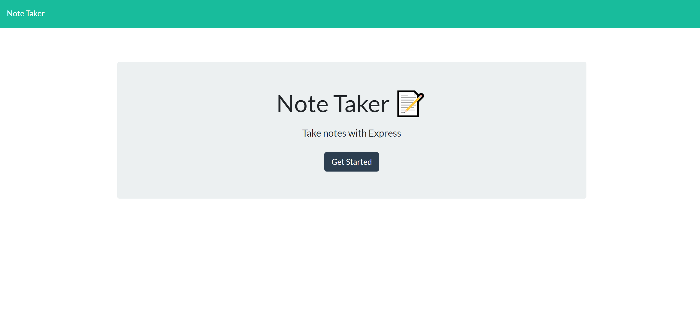

 
# Note Taker  

## Project Description 
Note Taker is an app that is used to write and save notes. This application uses an Express.js back end and saves and retrieves note data from a JSON file. The application is easy to use, and users can delete old notes. 

## Table of Content

* [Installation](#installation)

* [Usage](#usage)

* [License](#License)

* [Contribution](#Contribution)

* [Credit](#Credits)

* [Test](#Test)

* [Question](#Question) 

## Installation
There are no specific installation instructions.

Below is the URL to the webpage and github repository. 

Website URL: https://arcane-hamlet-15719.herokuapp.com/notes

Github repository: https://github.com/synag/note_taker

## Usage
Minimum instructions 

The sreenshot for the Note Taker is below. 

## License
The license used for this project is MIT. Here is the license link https://opensource.org/licenses/MIT

## Credits
Node, CSS, HTML, Express, and Node-Uniqueid

## Contribution
 No contribution guidelines

## Test
No Test Instructions

## Questions
Please contact me with any questions.  

* Github username: synag
* Github URL: https://github.com/synag
* Email:  cbenbow82@gmail.com 